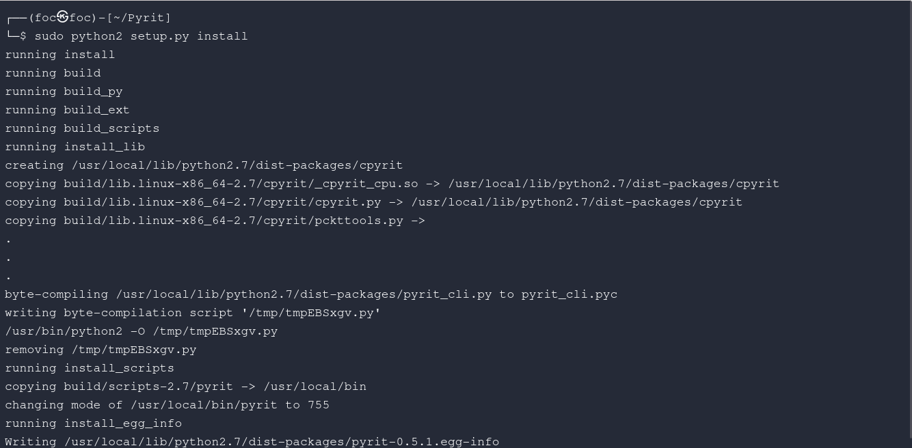
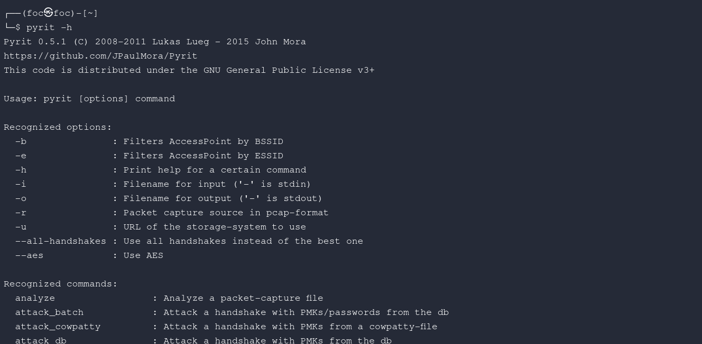

█▀ ▀█▀ █▀▀ █▀█ ▄▄ ▄█ ▀   █░█ █▀█ █▀▄ ▄▀█ ▀█▀ █▀▀   █▀ █▄█ █▀ ▀█▀ █▀▀ █▀▄▀█   ▄▀█ █▄░█ █▀▄   █ █▄░█ █▀ ▀█▀ ▄▀█ █░░ █░░
▄█ ░█░ ██▄ █▀▀ ░░ ░█ ▄   █▄█ █▀▀ █▄▀ █▀█ ░█░ ██▄   ▄█ ░█░ ▄█ ░█░ ██▄ █░▀░█   █▀█ █░▀█ █▄▀   █ █░▀█ ▄█ ░█░ █▀█ █▄▄ █▄▄

█▀▄ █▀▀ █▀█ █▀▀ █▄░█ █▀▄ █▀▀ █▄░█ █▀▀ █ █▀▀ █▀
█▄▀ ██▄ █▀▀ ██▄ █░▀█ █▄▀ ██▄ █░▀█ █▄▄ █ ██▄ ▄█

For packages that need to be installed on your system, execute the following commands in terminal.
Update the system:

```  sudo apt update -y   ```

# 𝕴𝖓𝖘𝖙𝖆𝖑𝖑 𝖙𝖍𝖊 𝖉𝖊𝖕𝖊𝖓𝖉𝖊𝖓𝖈𝖎𝖊𝖘:

```  sudo apt install git python2-dev libssl-dev libpcap-dev -y   ```

 

█▀ ▀█▀ █▀▀ █▀█ ▄▄ ▀█ ▀   █▀▀ █▀█ █▀▄▀█ █▀█ █ █░░ █▀▀   █▀█ █▄█ █▀█ █ ▀█▀
▄█ ░█░ ██▄ █▀▀ ░░ █▄ ▄   █▄▄ █▄█ █░▀░█ █▀▀ █ █▄▄ ██▄   █▀▀ ░█░ █▀▄ █ ░█░
Pull the application from the Github page:

```  git clone https://github.com/JPaulMora/Pyrit.git --depth=1   ```

```  sed -i "s/COMPILE_AESNI/COMPILE_AESNIX/" Pyrit/cpyrit/_cpyrit_cpu.c    ```

#   🇭​​​​​ 🇮​​​​​ 🇳​​​​​ 🇹​​​​​
If you skip the above step, you will get the following error after pyrit -h command:

Traceback (most recent call last):
  File "/usr/local/bin/pyrit", line 4, in <module>
    import pyrit_cli
  File "/usr/local/lib/python2.7/dist-packages/cpyrit/util.py", line 54, in <module>
    import _cpyrit_cpu
ImportError: /usr/local/lib/python2.7/dist-packages/cpyrit/_cpyrit_cpu.so: undefined symbol: aesni_key

ᴿᵘⁿ ᵗʰᵉ ᶠᵒˡˡᵒʷⁱⁿᵍ ˢᵗᵉᵖˢ ⁱⁿ ᵒʳᵈᵉʳ⠘

``` pyrit -h ``` 

```   python2 setup.py clean   ```

 ```   python2 setup.py build   ``` 

running build
running build_py
creating build
creating build/lib.linux-x86_64-2.7
copying pyrit_cli.py -> build/lib.linux-x86_64-2.7
creating build/lib.linux-x86_64-2.7/cpyrit 
running build_scripts
creating build/scripts-2.7
copying and adjusting pyrit -> build/scripts-2.7
changing mode of build/scripts-2.7/pyrit from 644 to 755  


█████████████████████████████████████████████████████████████████████████████████
█─▄▄▄▄█─▄─▄─█▄─▄▄─█▄─▄▄─█▀▀▀▀▀██▄▄▄░███▄─▄█▄─▀█▄─▄█─▄▄▄▄█─▄─▄─██▀▄─██▄─▄███▄─▄███
█▄▄▄▄─███─████─▄█▀██─▄▄▄█████████▄▄░████─███─█▄▀─██▄▄▄▄─███─████─▀─███─██▀██─██▀█
▀▄▄▄▄▄▀▀▄▄▄▀▀▄▄▄▄▄▀▄▄▄▀▀▀▀▀▀▀▀▀▀▄▄▄▄▀▀▀▄▄▄▀▄▄▄▀▀▄▄▀▄▄▄▄▄▀▀▄▄▄▀▀▄▄▀▄▄▀▄▄▄▄▄▀▄▄▄▄▄▀
█████████████████████████████
█▄─▄▄─█▄─█─▄█▄─▄▄▀█▄─▄█─▄─▄─█
██─▄▄▄██▄─▄███─▄─▄██─████─███
▀▄▄▄▀▀▀▀▄▄▄▀▀▄▄▀▄▄▀▄▄▄▀▀▄▄▄▀▀

 # 𝕀𝕥 𝕞𝕒𝕪 𝕘𝕚𝕧𝕖 𝕤𝕠𝕞𝕖 𝕨𝕒𝕣𝕟𝕚𝕟𝕘𝕤 𝕒𝕗𝕥𝕖𝕣 𝕔𝕠𝕞𝕡𝕚𝕝𝕒𝕥𝕚𝕠𝕟. 𝕋𝕙𝕖𝕟 𝕣𝕦𝕟 𝕥𝕙𝕖 𝕚𝕟𝕤𝕥𝕒𝕝𝕝 𝕔𝕠𝕞𝕞𝕒𝕟𝕕:
```sudo python2 setup.py install```







